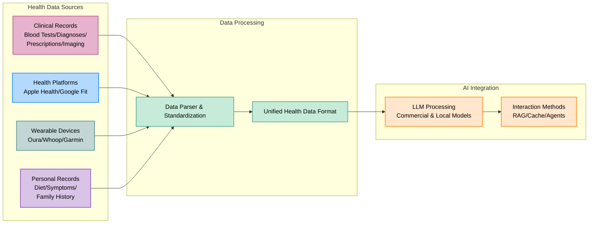

# 🚀 **healthnest-ai**

<div align="center">

**AI Health Assistant | Powered by Your Data**

<p align="center">
  
  
  
</p>

> **Upstream web demos:** The original OpenHealth project provides two options:  
> **[Clinic](https://qna.open-health.me/)** — Quick health consultations  
> **[Full Platform](https://www.open-health.me/)** — Comprehensive health management tools

### 🌍 Choose Your Language

[English](README.md) | [Français](i18n/readme/README.fr.md) | [Deutsch](i18n/readme/README.de.md) | [Español](i18n/readme/README.es.md) | [한국어](i18n/readme/README.ko.md) | [中文](i18n/readme/README.zh.md) | [日本語](i18n/readme/README.ja.md) | [Українська](i18n/readme/README.uk.md) | [Русский](i18n/readme/README.ru.md) | [اردو](i18n/readme/README.ur.md)

</div>

> **Naming note:** This README presents the project as **healthnest-ai**. The repository URL, `open-health` directory, original project demos, star history, and community contacts below still belong to OpenHealth; they are not healthnest-ai releases or accounts.

---

<p align="center">
  
</p>

## 🌟 Overview

> healthnest-ai helps you **take charge of your health data**. By using AI and your personal health information, it provides a private assistant to help you better understand and manage your health. You can run it locally for greater privacy.

## ✨ Project Features

<details open>
<summary><b>Core Features</b></summary>

- 📊 **Centralized Health Data Input:** Consolidate your health data in one place.
- 🛠️ **Smart Parsing:** Parse health data and generate structured data files.
- 🤝 **Contextual Conversations:** Use structured data as context for personalized interactions with GPT-powered AI.

</details>

## 📥 Supporting Data Sources & Language Models

<table>
  <tr>
    <th>Data Sources You Can Add</th>
    <th>Supported Language Models</th>
  </tr>
  <tr>
    <td>
      • Blood Test Results<br>
      • Health Checkup Data<br>
      • Personal Physical Information<br>
      • Family History<br>
      • Symptoms
    </td>
    <td>
      • LLaMA<br>
      • DeepSeek-V3<br>
      • GPT<br>
      • Claude<br>
      • Gemini
    </td>
  </tr>
</table>

## 🤔 Why We Built healthnest-ai

> - 💡 **Your health is your responsibility.**
> - ✅ Health management combines **your data** + **intelligence** to turn insights into actionable plans.
> - 🧠 AI can support long-term health management.

## 🗺️ Project Diagram



> **Note:** Data parsing currently runs in a separate Python server; a future TypeScript migration is planned.

## Getting Started

## ⚙️ How to Run healthnest-ai

<details open>
<summary><b>Installation Instructions</b></summary>

1. **Clone the upstream repository:**
   ```bash
   git clone https://github.com/OpenHealthForAll/open-health.git
   cd open-health
   ```

2. **Set up and run:**
   ```bash
   # Copy environment file
   cp .env.example .env

   # Start the application using Docker or Podman Compose
   docker compose --env-file .env up
   ```

   With Podman, use `podman compose --env-file .env up` instead. For existing users:
   ```bash
   # Generate an ENCRYPTION_KEY and add it to .env
   head -c 32 /dev/urandom | base64

   # Rebuild and start the application
   docker compose --env-file .env up --build
   ```
   Rebuild after changes to `.env`.

3. **Access healthnest-ai:** Open `http://localhost:3000` in your browser.

> **Note:** The system has parsing and LLM components. Parsing can use docling for local execution; the LLM can run locally with Ollama.

> **Note:** With Ollama and Docker, use `http://docker.for.mac.localhost:11434` on macOS or `http://host.docker.internal:11434` on Windows.

</details>

---

## Upstream Star History

[](https://star-history.com/#OpenHealthForAll/open-health&Date)

---

## 🌐 Original Project Community and Support

<div align="center">

### 💫 Share Your Story & Give Feedback
[](https://www.reddit.com/r/AIDoctor/)
[](https://discord.gg/B9K654g4wf)

### 🤝 Talk with the Original Team
[](https://calendly.com/open-health/30min)
[](mailto:sj@open-health.me)

</div>
